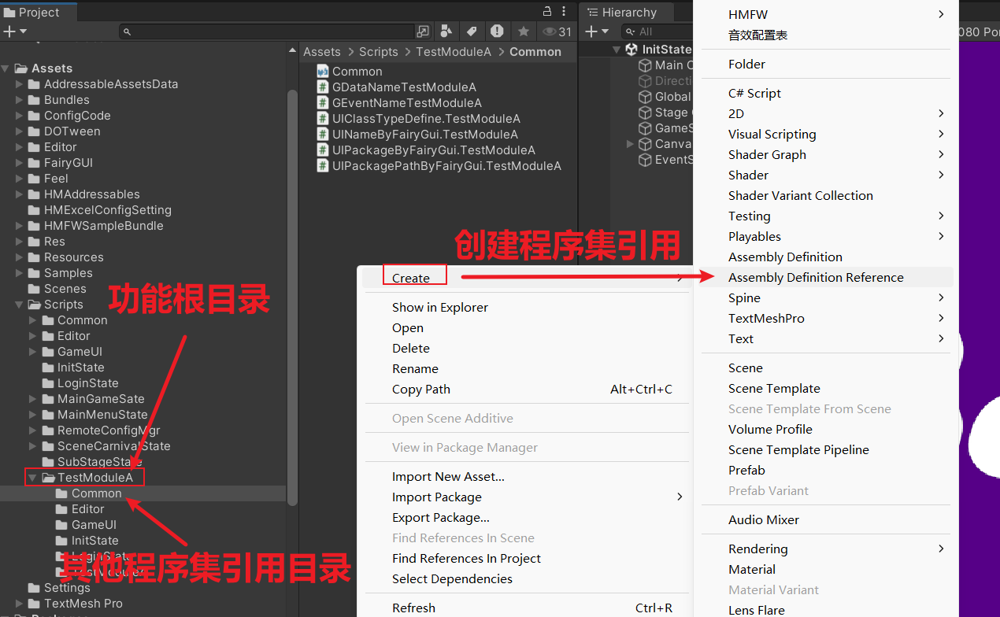
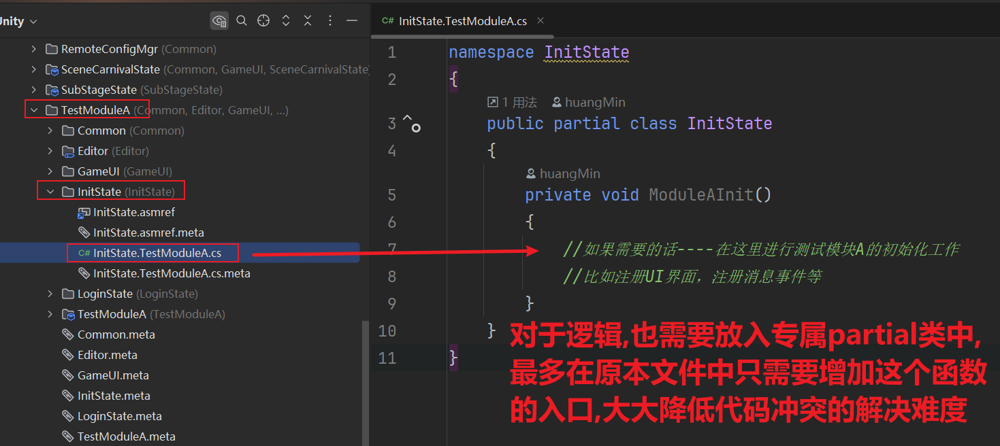
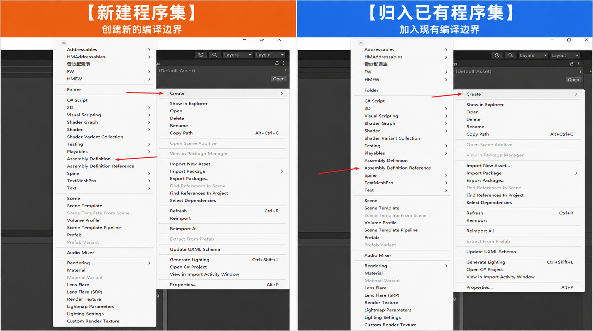

# Unity 工程代码结构规范（公司级）

| 文档属性 | 内容 |
|---|---|
| 适用范围 | 公司内部 Unity 游戏、应用、共享 Package 与工具项目 |
| 文档级别 | 公司工程基线 |
| 文档状态 | 正式 |
| 版本 | 1.3 |
| 最近更新 | 2026-09-07 |
| 归口角色 | 公司 Unity 技术委员会或授权技术负责人 |
| 复审周期 | 每 12 个月，或 Unity LTS、构建系统及包管理策略升级时 |
| 配套文档 | [Unity C# 代码规范](CodeStyleGuide.md) |

## 1. 目的与适用方式

本规范定义与具体项目无关的 Unity 代码目录、模块边界、程序集、命名空间、资产归属和多人协作原则。
它不规定某个项目必须使用哪一种 UI、资源、网络、存档或热更新框架。

每个项目必须提供项目级补充，至少说明：

- 公司和产品目录根、程序集清单以及历史命名兼容项；
- Unity 版本、目标平台和脚本后端；
- 采用的 UI、资源、异步、依赖管理和热更新方案；
- 项目模块列表、依赖图和组合入口；
- 历史兼容目录、命名和临时例外；
- 构建、测试和发布入口。

项目补充可以收紧本规范；需要偏离时必须记录原因、影响范围、负责人和退出条件。历史目录只是现状，不能
自动成为新模块模板。

## 2. 总体原则

### 2.1 先确定所有权，再确定目录

每个文件都应能回答：

1. 哪个产品或 Package 拥有它？
2. 哪个功能或平台拥有它？
3. 它在运行时、编辑器还是测试环境中使用？
4. 谁可以依赖它？
5. 它是手写、生成还是第三方内容？

无法回答这些问题的 `Common`、`Misc`、`Temp`、`NewFolder` 和超大型 `Utils` 目录不得进入正式结构。

### 2.2 目录、程序集、命名空间各司其职

- **目录**表达代码和资产的所有权及查找路径；
- **程序集**表达编译、平台和依赖边界；
- **命名空间**表达 C# 类型边界并防止名称冲突；
- **Package**表达可跨项目独立版本化和分发的产品边界。

目录可以按功能聚合分散在多个程序集中的代码；程序集决定脚本的编译归属；命名空间必须严格跟随实际
程序集，而不是跟随目录。移动文件、改变程序集归属或修改命名空间仍是三种不同变更，评审时必须分别检查
影响。

### 2.3 依赖必须是有向无环图

- 高层流程可以依赖低层稳定抽象；低层不得反向引用具体 UI、场景或玩法。
- 功能之间不通过相互添加引用解决共享问题。
- 跨功能契约放在明确的 Core、Contracts 或共享 Package 中，不能把实现整体搬入公共层。
- 禁止循环依赖；出现循环通常表示职责或契约位置错误。

## 3. 仓库顶层结构

新项目建议采用以下基线。尖括号表示项目初始化时必须替换的名称，不是真实目录名。

```text
<Repository>/
├── Assets/
│   ├── Scripts/
│   │   ├── Common/               # 可选：跨模块基础程序集
│   │   ├── GameUI/               # 可选：项目统一 UI 程序集
│   │   ├── Modules/              # 不创建独立程序集的功能根目录
│   │   ├── <FeatureName>/        # 创建独立程序集的功能一级目录
│   │   └── Editor/               # 项目编辑器代码及其程序集边界
│   ├── Generated/                # 可再生输出；也可由生成器使用固定目录
│   ├── Content/                  # Scene、Prefab、UI、音频等产品资产
│   └── ThirdParty/               # 非 Package 形式的供应商内容
├── Packages/                     # UPM 依赖和嵌入式共享模块
├── ProjectSettings/              # Unity 项目设置
├── UserSettings/                 # 默认不作为团队配置来源
├── Build/                        # 构建脚本与流水线配置，可按仓库平台调整
├── Docs/                         # 项目架构、决策记录和操作说明
├── .editorconfig
└── README.md
```

要求：

- 公司手写内容不得与 Asset Store 或供应商内容混放。
- 不提交 `Library/`、`Temp/`、`Logs/`、`obj/` 等可重建目录。
- 构建产物默认输出到仓库外或被忽略目录，不能写回运行时资产目录。
- Unity 资产与对应 `.meta` 必须一起移动、删除和提交，优先通过 Unity Editor 操作。
- 需要**【新建程序集】**的功能直接作为 `Assets/Scripts/` 一级功能根目录；只有当它确实拥有独立编译
  边界时才占用一级目录。
- 不需要独立程序集的功能进入 `Assets/Scripts/Modules/<FeatureName>/`，再按目标程序集划分归属目录。
- `Modules` 是公司标准拼写；旧项目已有 `Moudles` 等拼写时仅作为项目兼容目录保留。
- 顶层目录数量保持稳定；新功能不得随意新增 `Assets/` 一级目录。

## 4. 推荐的逻辑分层

公司基线采用“功能优先、层次受控”的混合结构。小项目可以合并物理目录，但依赖方向不变。

```text
Bootstrap / Composition
        |                \
        v                 v
Presentation ------> Application <------ Infrastructure
                           |
                           v
                         Domain
                           |
                           v
                       Foundation
```

| 层 | 主要职责 | 不应包含 |
|---|---|---|
| Foundation | 极稳定的基础类型、通用算法和平台无关能力 | 具体产品规则、UI、场景流程 |
| Domain | 核心业务规则、实体和值对象 | Unity 视图、网络 SDK、存档实现 |
| Application | 用例编排、命令、查询和业务接口 | 具体 UI 节点、供应商 SDK 细节 |
| Presentation | UI、视图状态、输入适配和表现 | 核心规则、持久化实现 |
| Infrastructure | 资源、网络、存储、分析和平台服务实现 | UI 流程和领域规则 |
| Bootstrap/Composition | 启动、场景或状态编排以及依赖装配 | 可复用业务算法 |

说明：

- Unity 组件可以出现在 Presentation、Infrastructure 或 Bootstrap，但不因此改变依赖方向。
- Domain 不强制用于所有项目；简单项目可以把 Domain 与 Application 合并为 Runtime，但 UI 与业务仍需分离。
- Foundation 必须保持小而稳定，不能成为无法归类代码的收容区。

## 5. 功能优先的模块结构

### 5.1 标准功能模板

```text
Assets/Scripts/<FeatureName>/
├── Common/
│   ├── Common.asmref                 # 【归入已有程序集】脚本属于 Common
│   └── <FeatureCommonCode>.cs
├── GameUI/
│   ├── GameUI.asmref                 # 【归入已有程序集】脚本属于 GameUI
│   └── <FeatureView>.cs
├── <OtherExistingAssembly>/          # 按需创建，例如 InitState、LoginState
│   └── <OtherExistingAssembly>.asmref
└── <FeatureAssembly>/
    ├── <FeatureAssembly>.asmdef      # 【新建程序集】创建功能业务边界
    ├── Domain/                       # 可选：纯业务规则
    ├── Application/                  # 可选：用例和对外接口
    └── Infrastructure/               # 可选：该功能的外部服务实现
```

`Common`、`GameUI`、`InitState` 等只是公司常用职责名；项目可以删减或在项目补充中登记等价职责名。关键
规则是：功能根目录负责聚合所有相关脚本，每个归属目录以目标程序集命名，目录内脚本使用目标程序集的
同名单层命名空间。

不需要独立程序集的小功能使用同样的归属方式，但放在 `Assets/Scripts/Modules/<FeatureName>/`，不创建
`<FeatureAssembly>/` 和**【新建程序集】程序集定义文件**。只创建实际需要的目录；小功能可以保持扁平，
禁止预先建立大量空目录。



*图 1：功能根目录聚合脚本，子目录按目标程序集命名，并通过【归入已有程序集】目录归属文件编入对应程序集。*



*图 2：功能逻辑写入 `<原类型>.<功能名>.cs` 这类 partial 文件，原类型只增加一个入口；这样多人改动同一公共类型时冲突面只剩一行。*

### 5.2 共享代码判断

代码进入共享层前必须同时满足：

- 至少被两个独立功能实际使用；
- 名称和 API 不依赖某个功能的隐含上下文；
- 移入后不会导致底层反向依赖；
- 有明确维护者和兼容策略。

仅仅“以后可能会复用”不能作为移动到 Shared、Common 或 Foundation 的理由。重复的两三行简单代码也不必
急于抽象；先确认概念真的相同。

### 5.3 可复用 Package

满足以下条件时，应评估创建 UPM Package，而不是继续放在产品 Assets 下：

- 可被多个项目独立使用；
- 有稳定公开 API 和独立版本；
- 能独立测试和发布；
- 不依赖某个产品的资源 GUID、Scene 或业务类型。

```text
Packages/com.<company>.<package>/
├── package.json
├── Runtime/
│   └── <PackageName>.asmdef
├── Editor/
│   └── <PackageName>Editor.asmdef
├── Tests/
│   ├── <PackageName>Tests.asmdef
│   ├── EditMode/
│   └── PlayMode/
├── Documentation~/
├── Samples~/
└── CHANGELOG.md
```

Package 标识使用小写反向域名格式。程序集和命名空间使用同一个单层 PascalCase 职责名；不得把
`com.<company>.<package>` 转写为多层 C# 名称。共享 Package 的程序集名必须在公司包登记中保持唯一，
例如 Package 标识为 `com.acme.addressables` 时，可使用已登记的 `AcmeAddressables` 程序集及同名命名空间。

## 6. 程序集设计

### 6.1 何时创建程序集

满足以下任一条件时，才创建新的程序集边界：

- 需要阻止不合理依赖；
- 需要独立的平台、Define Constraint 或 Editor 限制；
- 需要显著缩小迭代编译范围；
- 需要作为 Package 独立版本化；
- 需要建立独立测试边界。

不要为每个目录或每个小功能创建程序集。程序集越多，引用、编译顺序和维护成本越高；应从较粗边界开始，
由真实依赖和测量结果推动拆分。

### 6.2 两类程序集资产必须按动作称呼

为避免只相差一个字符的扩展名造成误解，公司文档、评审和任务描述统一使用以下动作标签：

- **【新建程序集】程序集定义文件**：Unity Assembly Definition，后缀为 `.asmdef`；创建新的程序集、
  名称和编译边界。
- **【归入已有程序集】目录归属文件**：Unity Assembly Definition Reference，后缀为 `.asmref`；
  不创建程序集，只把当前目录的脚本编入一个已经存在的程序集。



*图 3：橙色表示【新建程序集】，蓝色表示【归入已有程序集】；评审时先说动作，再补充真实后缀。*

| 判断项 | 【新建程序集】程序集定义文件 | 【归入已有程序集】目录归属文件 |
|---|---|---|
| 是否产生新程序集 | 是 | 否 |
| 是否拥有依赖列表 | 是 | 否，沿用目标程序集依赖 |
| 典型用途 | 建立模块、Runtime、Editor 或 Tests 边界 | 把分散目录归入同一已有边界 |
| 常见错误 | 创建过多微型程序集 | 误以为它只是“引用另一个程序集” |

只是希望本程序集调用另一个程序集时，应在本程序集的**【新建程序集】程序集定义文件**中添加引用；不要放置
**【归入已有程序集】目录归属文件**，否则代码本身会改变归属。

### 6.3 标准程序集关系

箭头表示程序集依赖方向；项目只创建实际需要的程序集，不要求照搬全部名称：

```text
Bootstrap
        ├──> FeatureA
        ├──> FeatureB
        ├──> GameUI
        └──> Infrastructure

FeatureA / FeatureB / GameUI / Infrastructure
        └──> Common / Foundation

ProjectEditor  ------> 所需 Runtime 程序集
ProjectTests   ------> 被测试的 Runtime 程序集
```

- Runtime 程序集禁止引用 Editor 和 Tests。
- Editor 程序集只包含 Editor 平台代码，并显式引用所需 Runtime 程序集。
- Tests 程序集只引用被测程序集和测试框架。
- 兄弟功能默认互不引用；共享契约应下沉到稳定边界。
- 公司手写程序集使用单层 PascalCase 职责名。项目业务程序集不添加公司、产品、Runtime 或目录层级
  前缀，例如 `Common`、`GameUI`、`Inventory`、`InventoryEditor`、`InventoryTests`；跨项目 Package
  可以使用公司登记的唯一包名，但仍不得使用点号建立层级。
- 程序集名称必须在项目编译域内唯一并表达明确职责，不使用 `Assembly1`、`Scripts`、`ModuleNew`。
- 第三方、框架和历史程序集已有带点名称时保持来源兼容；新业务程序集不得复制该命名形式。

### 6.4 Editor 目录不是完整边界

当上级目录已经受**【新建程序集】程序集定义文件**控制时，名为 `Editor` 的子目录可能不再自动进入 Unity
预定义 Editor 程序集。Editor 代码必须使用仅包含 Editor 平台的程序集，或通过**【归入已有程序集】目录归属
文件**加入已经存在的 Editor 程序集。不能只依靠文件夹名字判断代码不会进入 Player。

### 6.5 创建与检查

- 优先通过 Unity 创建程序集资产，避免手写或复制错误 GUID。
- 自动化编辑**【归入已有程序集】目录归属文件**前必须核验目标 `.meta` GUID。
- 同一目录不得同时存在相互冲突的程序集定义和目录归属资产。
- 调整引用后必须检查反向依赖、循环依赖、平台设置和测试可见性。
- 若程序集使用 GUID 引用，移动资产时必须连同 `.meta` 一起处理。

## 7. 命名空间与程序集映射

公司标准映射如下：

| 程序集 | 命名空间示例 |
|---|---|
| `Common` | `Common` |
| `GameUI` | `GameUI` |
| `Inventory` | `Inventory` |
| `InventoryEditor` | `InventoryEditor` |
| `InventoryTests` | `InventoryTests` |

要求：

- 命名空间只允许一层 PascalCase，并与脚本实际编入的程序集名称完全一致。
- 目录层级不产生下级命名空间；`GameUI/Inventory/` 中编入 `GameUI` 的脚本仍使用 `namespace GameUI`，
  不使用 `namespace GameUI.Inventory`。
- 通过**【归入已有程序集】目录归属文件**加入 `Common`、`GameUI` 等现有程序集时，脚本必须使用目标
  程序集的命名空间。
- 同一 `partial` 类型的所有文件必须使用完全相同的命名空间。
- 命名空间不跟随临时组织目录、开发者姓名或迭代编号变化。
- 生成器输出命名空间必须由项目配置提供，不能硬编码成示例项目名称。
- 若**【新建程序集】程序集定义文件**使用 `rootNamespace`，其值应与程序集名称一致；工具链不依赖该
  字段时可以留空，但显式命名空间规则不变。
- 项目已有无命名空间、多层命名空间、带点程序集名或程序集与命名空间不一致时，作为项目级兼容例外
  记录；不在普通功能任务中迁移，也不得复制为新模块模板。

## 8. 运行时、Editor、测试与生成代码隔离

### 8.1 Runtime

- 只能包含 Player 构建需要的代码。
- 禁止直接引用 `UnityEditor`。
- 若少量调试代码确需条件编译，必须保证 Player 分支可独立编译；复杂工具移入 Editor 程序集。

### 8.2 Editor

- 自定义 Inspector、导入器、生成器、构建工具和菜单放入 Editor 边界。
- Editor 可以引用 Runtime；Runtime 禁止引用 Editor。
- 构建流水线代码与日常内容工具可以继续按职责拆分，避免一个无边界 Editor 程序集。

### 8.3 Tests

```text
Tests/
├── EditMode/     # 纯逻辑、序列化、编辑器和快速组件测试
└── PlayMode/     # 帧、场景、协程、物理和运行时集成测试
```

测试程序集的类型可见性通过公开 API 或明确的 `InternalsVisibleTo` 设计解决，不得为了测试把所有生产类型改成
`public`。

### 8.4 Generated

- 生成输出必须与手写代码物理分开。
- 目录应可由确定输入重建，并在 README 或文件头记录生成入口。
- 是否提交生成结果由项目构建链决定，但同一类输出必须统一策略。
- 首次生成后由开发者维护的脚手架不能放进“禁止手改”的 Generated 区。

## 9. 资产结构与资源边界

### 9.1 产品资产

代码和内容资产都优先按功能聚合：

```text
Content/
└── <FeatureName>/
    ├── Scenes/
    ├── Prefabs/
    ├── UI/
    ├── Art/
    ├── Audio/
    ├── Data/
    └── Localization/
```

大型美术流水线可以按资产类型建立专用根目录，但必须在项目补充中记录命名、导入设置、负责人和功能资产
的查找方式。

### 9.2 Resources、StreamingAssets 与运行时加载

- 项目必须指定主要资源系统及其地址、分组、加载、取消和释放规则。
- `Resources/` 仅放必须通过 `Resources` API 加载的少量资产，禁止成为默认内容目录。
- `StreamingAssets/` 只用于必须以原始文件形式随包发布的内容，并考虑不同平台访问方式。
- 资源地址和标签属于公开数据契约，重命名前必须评估远端内容、存档和热更新兼容性。
- Scene、Prefab、材质等资产的引用和 `.meta` GUID 必须可追踪，禁止在文件系统外部复制后丢失元数据。

### 9.3 ScriptableObject

- 类型定义属于相应 Runtime 模块；资产实例属于功能 `Content/Data/` 或项目指定配置目录。
- 跨项目通用的 ScriptableObject 类型进入共享 Package，不进入某个项目的公共收容目录。
- 只读配置和运行时状态必须有清晰边界，避免 Play Mode 修改污染资产。

## 10. 第三方、平台与本地化内容

- 第三方 Package 优先通过 UPM 锁定版本；直接放入 Assets 的内容进入 `ThirdParty/<Vendor>/<Package>/`。
- 禁止在第三方目录混入产品业务代码。
- 必须修改供应商代码时，记录原始版本、补丁原因和升级合并方式。
- 平台 SDK 通过 Infrastructure 适配层暴露项目接口，业务代码不直接散落供应商 API。
- 平台专属代码使用平台程序集或集中适配文件，避免全项目散布条件编译。
- 本地化表、字体和语言资源按项目的本地化系统统一管理，不把可翻译文本硬编码到业务流程。

## 11. 多人协作与代码所有权

- 功能根目录是默认所有权边界；代码评审人应来自该功能或其依赖边界的维护者。
- 公共层和程序集依赖变更需要更高等级评审，因为影响多个功能。
- 多人扩展同一公共类型时，优先拆服务或使用 `<Type>.<Responsibility>.cs`，不按人员姓名或数字拆文件。
- 生成文件由生成器单点维护，禁止多人分别修补输出。
- 大规模移动、命名空间变更和程序集拆分作为独立迁移任务，不与功能开发混合。
- 推荐使用 CODEOWNERS、架构决策记录或等效机制明确边界负责人。

## 12. 新模块创建流程

1. **定义职责**：写清模块解决的问题、不解决的问题、生命周期和负责人。
2. **列出依赖**：区分业务契约、框架、第三方 SDK 和内容资产。
3. **选择归属**：决定属于产品 Feature、基础层还是可复用 Package。
4. **设计边界**：从较粗程序集开始，只为真实依赖、平台或编译需求拆分。
5. **确定命名**：确定目录、程序集、命名空间和 Package 标识。
6. **建立 Runtime/Editor/Tests**：只创建实际需要的边界，并保证依赖方向正确。
7. **选择资源策略**：定义资源地址、加载、所有权、取消和释放。
8. **定义接入点**：在组合根接入，不直接修改多个无关功能。
9. **添加验证**：至少覆盖核心规则、边界条件和程序集归属。
10. **更新文档**：更新模块清单、依赖图、负责人和项目例外。

## 13. 历史项目迁移原则

- 发布公司规范不等于立即整理所有旧项目。
- 先为旧项目编写现状图和项目级补充，再约束新增代码。
- 优先阻止新增循环依赖、默认程序集散落代码和 Runtime 引用 Editor。
- 目录移动必须与 Unity 资产和 `.meta` 一起执行，并验证场景、Prefab、序列化和资源地址。
- 程序集拆分、命名空间迁移和公共 API 重命名必须可回滚，必要时分阶段兼容。
- 不在普通需求中顺手迁移完整模块；迁移任务应有验证范围和完成标准。

## 14. 目录级结构规范性审核

功能提交前可对目标目录做结构规范性审核。通用的审核输入、问题分级、结论门槛、报告和修改建议格式统一遵循
[代码规范 §16](CodeStyleGuide.md#16-开发自检与目录级规范性审核)，本节只补充 Unity 目录和程序集证据。
本节只判断工程结构是否符合规范，不评价功能实现、业务逻辑、算法、运行结果、性能或测试充分性。

### 14.1 必须建立的结构清单

评审人不能只根据目录名推断脚本归属。审核目标目录时，应按实际资产建立下列清单：

| 检查对象 | 必须取得的证据 | 要回答的问题 |
|---|---|---|
| 功能根目录 | 目录树、功能说明、项目结构补充 | 它是独立程序集功能，还是 `Modules` 下的非独立功能？ |
| `.cs` 文件 | 文件来源、最近的程序集资产、显式命名空间 | 是手写、生成还是第三方；实际编入哪个程序集？ |
| 【新建程序集】资产 | 程序集名称、引用、平台、Define Constraint、`autoReferenced` | 是否真的需要新边界；依赖方向是否正确？ |
| 【归入已有程序集】资产 | 资产内容引用的 GUID 及其目标程序集 | 当前目录究竟被编入哪个已有程序集？ |
| Editor 与 Tests | 所属程序集的平台限制和引用 | 是否可能进入 Player；测试是否只引用被测边界？ |
| `partial` 与公共定义 | 所有片段位置、命名空间和目标程序集 | 是否属于同一类型；是否把功能所有权重新集中到全局文件？ |
| 资源与配置 | 所在目录、来源、所有者、地址和命名配置 | 是否放在规定目录；是否符合所有权、来源隔离和命名规则？ |

**【归入已有程序集】目录归属文件**的文件名只用于帮助识别，不能作为最终证据。必须解析它实际引用的
GUID，并找到目标**【新建程序集】程序集定义文件**及其 `.meta`；文件名与目标不一致时按实际 GUID 报告。
没有程序集资产控制的脚本还必须确认它是否意外落入 Unity 预定义程序集。

### 14.2 审核步骤

1. **画出功能边界**：列出目标目录及与它直接相关、但位于目录外的 `partial`、公共契约、入口和测试。
2. **确认实际归属**：为每组脚本确定程序集、命名空间、Runtime/Editor/Tests 环境和来源类型。
3. **还原依赖图**：从程序集资产读取直接引用，再结合代码调用检查是否存在反向、兄弟或循环依赖。
4. **核对职责分区**：确认 UI、业务、基础设施、启动接入、生成代码和资源没有越界混放。
5. **核对新旧规则**：本次新增和修改必须符合公司基线；项目登记的旧目录、错拼或越界依赖只作兼容项。
6. **检查结构影响范围**：公共层、程序集引用、命名空间、资源地址或公开契约的改变必须列出直接消费者；
   这里只确认需同步核对的文件和边界，不判断消费者的业务行为是否正确。
7. **形成证据表**：按目录或同归属文件组记录实际程序集、命名空间、依赖和结论，不能只输出目录树。

建议在审核报告中加入以下结构摘要：

```text
| 目录或文件组 | 来源 | 实际程序集 | 命名空间 | 直接项目依赖 | 结论 |
|---|---|---|---|---|---|
| <路径> | 手写/生成/第三方 | <程序集> | <命名空间> | <依赖> | 符合/问题编号 |
```

### 14.3 结构验收清单

- [ ] 文件是否具有明确的产品、功能、环境和来源所有权？
- [ ] 是否完整列出了功能根目录外的直接关联文件，而不是把目录当作绝对边界？
- [ ] 新目录是否符合产品或 Package 的既有根结构？
- [ ] 是否真的需要新的程序集，而不是只需要新目录？
- [ ] 是否正确区分【新建程序集】与【归入已有程序集】，并核验了实际 GUID 目标？
- [ ] 每组脚本的命名空间是否与实际程序集或登记的项目兼容映射一致？
- [ ] Runtime 是否完全不依赖 Editor 和 Tests？
- [ ] 功能之间是否避免反向引用、无说明的兄弟引用和循环依赖？
- [ ] UI、业务、基础设施和组合入口是否职责清楚？
- [ ] 公共层是否只包含稳定共享契约和能力，没有吸收功能实现？
- [ ] Generated 与可维护脚手架是否准确区分？
- [ ] 第三方代码是否与产品代码隔离并锁定版本？
- [ ] 资源和配置是否放入规定目录，并符合所有权、来源隔离、地址和命名规则？
- [ ] Editor、Tests、平台和 Define Constraint 是否与目标构建环境一致？
- [ ] 是否把历史例外错误地复制成新结构？
- [ ] 公共边界变化是否列出了需要同步核对结构规范的直接消费者？

### 14.4 结构问题的验收原则

以下情况至少按 P1 报告：新脚本编入错误程序集、Runtime 可能包含 Editor API、引入循环依赖、业务层新增
对具体 UI 的反向引用、【归入已有程序集】资产指向错误目标，或新代码复制了明确登记的历史错拼/越界结构。
若结构状态导致实际程序集归属无法确认、Runtime/Editor 边界失效或无法继续可靠审核，升级为 P0。

仅仅“目录还可以更漂亮”不能作为阻断理由。没有形成错误归属或依赖风险的目录命名、可选分层与文件整理，
通常作为 P2/P3；评审建议必须说明它改善的所有权、依赖或查找问题。

## 15. 参考资料与取舍

本规范参考公开企业规范的文档结构和 Unity 官方技术约束，再按公司多项目治理需求整理：

- [Unity：Assembly definitions](https://docs.unity3d.com/2022.3/Documentation/Manual/ScriptCompilationAssemblyDefinitionFiles.html)
- [Unity：Special folders and assembly boundaries](https://docs.unity3d.com/2022.3/Documentation/Manual/ScriptCompilationAssemblyDefinitionFiles.html#special-folders)
- [Unity：Script serialization](https://docs.unity3d.com/2022.3/Documentation/Manual/script-Serialization.html)
- [Unity：Test Framework](https://docs.unity3d.com/2022.3/Documentation/Manual/testing-editortestsrunner.html)
- [Microsoft：Framework naming guidelines](https://learn.microsoft.com/en-us/dotnet/standard/design-guidelines/naming-guidelines)
- [.NET Runtime：project coding guidelines](https://github.com/dotnet/runtime/blob/main/docs/coding-guidelines/project-guidelines.md)
- [Google：C# Style Guide](https://google.github.io/styleguide/csharp-style.html)

关键技术取舍以 Unity 官方行为为准：程序集资产决定脚本归属；上级程序集边界会改变 `Editor` 特殊目录行为；
Unity 序列化直接作用于字段；Edit Mode 和 Play Mode 测试承担不同验证职责。公司规范在这些事实之上采用功能
优先目录、受控分层和粗粒度起步的程序集策略。
