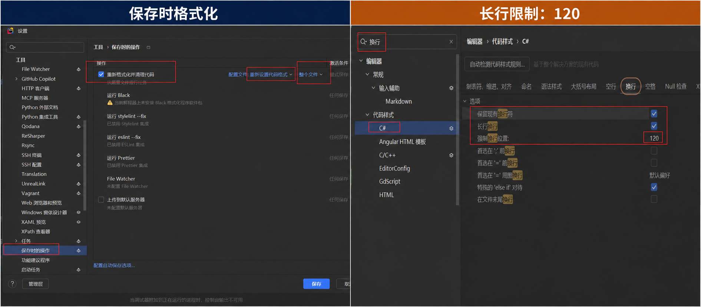
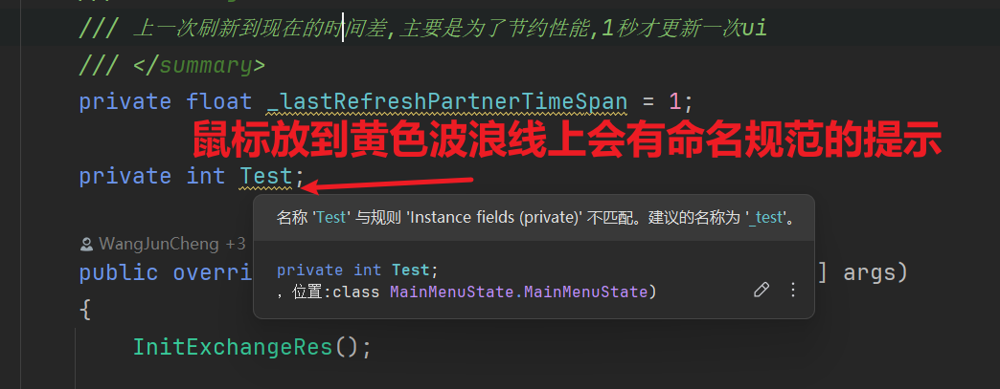
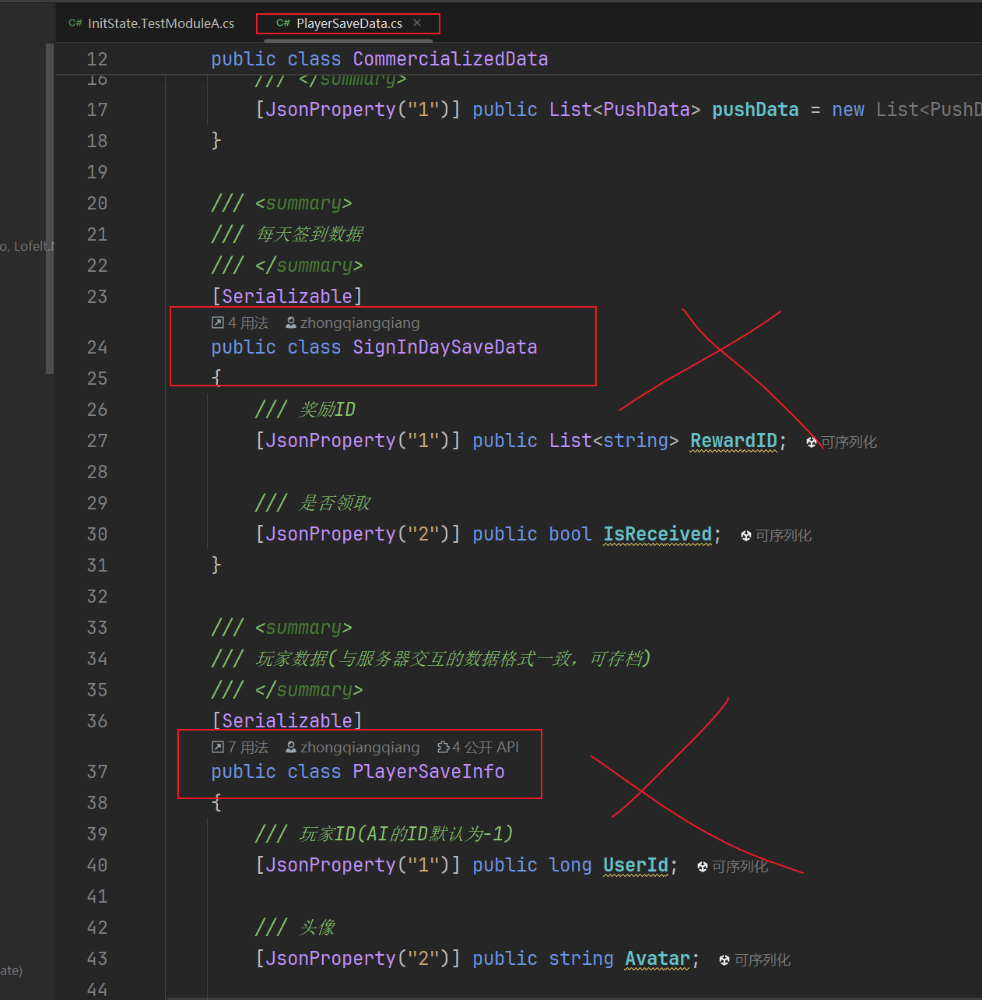
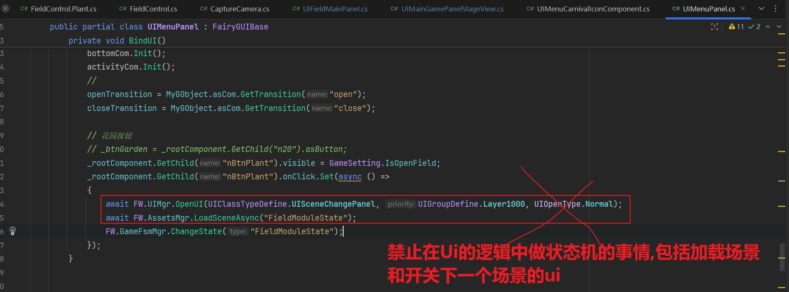

# Unity C# 代码规范（公司级）

| 文档属性 | 内容 |
|---|---|
| 适用范围 | 公司内部使用 C# 的 Unity 项目、共享 Unity Package 与工具仓库 |
| 文档级别 | 公司工程基线 |
| 文档状态 | 正式 |
| 版本 | 1.4 |
| 最近更新 | 2026-09-07 |
| 归口角色 | 公司 Unity 技术委员会或授权技术负责人 |
| 复审周期 | 每 12 个月，或 Unity LTS、C# 版本及核心工具链升级时 |
| 配套文档 | [Unity 工程代码结构规范](CodeStructureGuide.md) |

## 1. 目的、适用范围与优先级

本规范用于统一公司 Unity 项目的可读性、可维护性和协作方式，不依赖任何具体游戏、框架、UI
方案、资源系统或热更新方案。

规则优先级如下：

1. 法律、安全、平台和发布要求；
2. 本公司级规范；
3. 项目在 `AGENTS.md`、`PROJECT_CONVENTIONS.md` 或同类文件中明确记录的补充规则；
4. 模块局部约定。

项目规则可以收紧公司规范。确需偏离公司规范时，必须写明适用范围、原因、负责人和退出条件；历史代码
本身不是例外依据。第三方源码、自动生成文件和供应商代码遵循其来源规则，不因格式统一而直接改写。

本文使用以下约束词：

- **必须 / 禁止**：评审和自动检查应阻止违反项合入；
- **应 / 建议**：默认做法，偏离时应能说明理由；
- **可以**：根据项目场景选择。

## 2. 自动化与格式化基线

### 2.1 配置即规则

- 每个项目必须在仓库根目录提交 `.editorconfig`，并把可自动执行的格式规则写入其中。
- 新项目可以从 [Unity 项目 `.editorconfig` 模板](UnityProject.editorconfig.template) 起步：复制到项目根目录并
  重命名为 `.editorconfig`。模板的功能配置基于 Merge2Unity 当前规则，并增加了供人工和 AI 使用的审核
  说明；启用前必须按新项目的源码目录、生成目录、第三方目录和历史兼容项评审匹配范围，不能照搬路径。
- IDE 设置、格式化工具和 CI 应读取同一份配置，避免仅依赖个人 IDE 导出文件。
- 团队使用的 Rider 或其他编辑器必须支持 `.editorconfig`，格式结果必须一致。
- 项目升级 C#、Unity 或分析器版本时，应单独评审格式和诊断变化。

公开企业规范通常把一致性和自动化放在首位：Microsoft .NET Runtime 将 `.editorconfig` 作为格式化基线，
Google C# 规范也以统一规则降低大型代码库的理解成本。本规范采用相同思路，但针对 Unity 生命周期、序列化
和程序集边界增加约束。

### 2.2 基础排版

- 使用 UTF-8 BOM；换行符由仓库配置统一。
- 缩进使用 4 个空格，不使用制表符表达代码层级。
- 使用 Allman 花括号风格，控制语句始终写花括号。
- 一行一个语句，一行一个声明。
- 单行建议不超过 120 个字符；在参数、逻辑运算符或方法链的语义边界换行。
- 连续空行不超过一行；禁止行尾空格。
- `using` 放在命名空间外，`System.*` 在前，其余按字母顺序排列。
- 始终显式声明成员可见性。



*图 1：IDE 设置仅用于演示；公司规则的可执行来源应是仓库中的 `.editorconfig`。*

```csharp
using System;
using UnityEngine;

namespace Inventory
{
    public sealed class ItemPresenter : MonoBehaviour
    {
        [SerializeField] private string _itemId;

        public void Refresh()
        {
            if (string.IsNullOrWhiteSpace(_itemId))
            {
                Debug.LogError("Cannot refresh item: item id is empty.", this);
                return;
            }

            // Refresh the view.
        }
    }
}
```

## 3. 命名规范

### 3.1 命名总表

| 对象 | 规则 | 示例 |
|---|---|---|
| 程序集 | 单层 PascalCase，按职责命名；项目业务程序集不添加公司、产品或目录层级前缀 | `Inventory`、`GameUI`、`InventoryEditor` |
| 命名空间 | 单层 PascalCase，并与脚本实际编入的程序集同名 | `Inventory`、`GameUI`、`InventoryEditor` |
| 类、结构体、记录、委托 | PascalCase，使用名词或名词短语 | `InventoryService` |
| 接口 | `I` + PascalCase | `IInventoryRepository` |
| Attribute 类型 | PascalCase + `Attribute` | `ItemIdAttribute` |
| 方法 | PascalCase，使用动词或动词短语 | `LoadInventoryAsync` |
| 属性 | PascalCase，使用名词或状态 | `CurrentItem` |
| 事件 | PascalCase，描述已经发生的事实 | `InventoryChanged` |
| 枚举类型 | PascalCase；普通枚举用单数，Flags 枚举用复数 | `ItemState`、`ItemPermissions` |
| 枚举成员 | PascalCase | `Unavailable` |
| 常量 | UPPER_CASE，单词之间使用下划线 | `DEFAULT_CAPACITY` |
| 参数、局部变量 | camelCase | `itemConfig` |
| 私有/内部实例字段 | `_` + camelCase | `_currentItem` |
| 私有静态字段 | `_` + camelCase | `_sharedCache` |
| 内部静态字段 | `s_` + camelCase | `s_sharedCache` |
| 线程静态字段 | `t_` + camelCase | `t_buffer` |
| 类型参数 | `T` 或 `T` + 语义名 | `T`、`TConfig` |
| Unity 序列化私有字段 | `_` + camelCase | `_itemPrefab` |



*图 2：IDE 会按命名规则给出提示和改名建议；命名规则的最终来源是仓库配置，不是个人 IDE 设置。*

### 3.2 命名语义

- 标识符使用英文和通用技术缩写，优先清晰而不是短小。
- 禁止使用无语义名称，如 `Data1`、`Temp2`、`ManagerNew`、`UtilsEx`。
- 布尔值应表达真假问题，优先使用 `Is`、`Has`、`Can`、`Should` 等前缀。
- 异步方法以 `Async` 结尾；Unity 消息、接口实现和事件处理器可按既有签名例外。
- 集合使用复数或集合语义名称；单个对象不用复数。
- 缩写按单词处理，例如 `HttpClient`、`UiState`；平台或第三方 API 的固定拼写保持原样。
- 禁止把人员姓名、日期或序号作为长期代码所有权标识。

### 3.3 兼容名称

序列化字段、资源路径、协议字段、存档键和公开 API 可能构成兼容契约。修改此类名称前必须确认迁移策略；
不能仅为了符合命名规范破坏现有数据。项目级兼容名称必须被明确标注，不得复制到新设计中。

## 4. 文件、命名空间与类型组织

### 4.1 单文件单主类型

一个 `.cs` 文件原则上只定义一个顶层主类型，文件名与主类型名一致。允许的例外仅包括：

- 与主类型紧密绑定且很短的私有嵌套类型；
- 同一抽象的必要泛型或非泛型配对；
- 自动生成文件；
- 项目规范明确允许的单例访问扩展等强关联类型。

不要把多个无关 DTO、枚举或工具类堆放在同一文件中。



*图 3：反面示例。同一文件中堆放了多个无关 DTO，应各自独立成文件。*

### 4.2 命名空间

- 公司手写代码原则上只创建**单层 PascalCase 命名空间**，不得再创建下级命名空间。
- 命名空间必须与脚本实际编入的程序集名称完全一致。例如，脚本编入 `Common` 程序集，就使用
  `namespace Common`；不能因为文件位于 `Inventory/UI/` 而改为 `Common.Inventory.UI`。
- 通过**【归入已有程序集】目录归属文件**（后缀 `.asmref`）编入其他程序集的脚本，使用目标程序集的
  命名空间，不使用功能根目录名作为命名空间。
- 新建 Editor 或 Tests 程序集时，使用单层职责名，例如 `InventoryEditor`、`InventoryTests`；程序集与
  命名空间保持同名，不采用 `Inventory.Editor`、`Inventory.Tests` 形式建立层级。
- 若**【新建程序集】程序集定义文件**（后缀 `.asmdef`）使用 `rootNamespace`，其值应与程序集名称一致；
  项目工具链不依赖该字段时可以留空，但代码中的显式命名空间仍必须遵守本节规则。
- 扩展已有 `partial` 类型时，命名空间必须与原类型完全一致。
- 新项目选择文件范围或块范围命名空间后应保持一致；Unity 生成器不支持某种语法时，以生成链能力为准。

第三方程序集、框架程序集和旧项目可能存在带点程序集名、无命名空间或历史错拼。这些属于来源约束或项目
兼容项，不得作为新代码模板；是否迁移由独立迁移任务决定。

可跨项目分发的 Package 为避免程序集重名，可以使用公司登记的单层 PascalCase 包名，例如
`AcmeAddressables`；它仍须与命名空间同名，不能改写成 `Acme.Addressables` 多层形式。

### 4.3 partial 文件

`partial` 用于生成代码配套、平台差异或同一类型的清晰职责拆分，不用于隐藏过大的类。

```text
<TypeName>.<Responsibility>.cs
```

示例：

- `PlayerController.Input.cs`
- `PlayerController.Animation.cs`
- `InventoryPanel.Binding.cs`

如果一个 partial 片段可以独立成为服务或组件，应优先拆出新类型。

## 5. API 与类型设计

- 默认使用最小可见性；仅跨程序集使用的 API 才声明为 `public`。
- 优先使用属性表达状态，避免公开可变字段。
- 优先组合而不是深继承；继承层级应保持浅且职责明确。
- 一个类型只承担一组高度相关的职责；避免无边界的 `Manager`、`Helper` 和 `Utils`。
- 构造函数或初始化方法必须建立有效对象，不让对象长期处于“半初始化”状态。
- 对外 API 明确空值、所有权、线程和生命周期约束。
- 可不变的数据优先使用 `readonly`、只读接口或不可变值对象。
- 不返回可被外部随意修改的内部集合；按需要返回只读视图、快照或受控操作接口。
- 方法参数过多时使用有语义的参数对象，不使用无语义元组跨越公共 API。

## 6. 静态成员、全局状态与依赖

- 禁止新增无所有者、无生命周期的全局可变状态。
- 静态类适用于纯函数、扩展方法、常量或进程级基础设施；不得成为任意业务逻辑的容器。
- 单例必须说明创建时机、销毁时机、线程模型、测试替换方式和跨场景行为。
- 业务依赖应通过构造、初始化参数、序列化引用或项目批准的容器显式提供。
- 禁止使用 Service Locator 掩盖任意依赖；项目采用门面或容器时，应限制在组合根和明确的跨系统入口。
- 禁止从底层模块反向访问 UI、场景对象或具体玩法实现。

## 7. Unity 类型与生命周期

### 7.1 MonoBehaviour

- 只有需要 GameObject、组件生命周期或 Unity 回调的类型才继承 `MonoBehaviour`。
- 不在构造函数中访问 Unity API；依赖获取和状态建立放在明确的生命周期或初始化方法中。
- `Awake` 建立本对象内部引用，`OnEnable` 注册临时监听，`Start` 执行依赖其他对象的首次流程，
  `OnDisable` 注销监听，`OnDestroy` 释放最终资源。项目可以细化，但必须保持成对和可预测。
- 禁止依赖同一帧中不同 GameObject 的隐含回调顺序；必须排序时使用显式编排或 Script Execution Order。
- 高频路径中缓存组件引用，避免在 `Update`、`LateUpdate` 或 `FixedUpdate` 中重复查找。
- 不需要逐帧执行时不要保留空的 Unity 消息方法。

### 7.2 ScriptableObject

- `ScriptableObject` 适合共享配置、编辑器资产和可组合的数据定义。
- 默认把运行时可变状态与只读配置分开，避免在资产对象上留下 Play Mode 污染。
- 不把 `ScriptableObject` 当作无边界全局单例；其加载、缓存和释放方式由项目资源方案定义。

### 7.3 UI 与业务

- UI 层负责呈现、输入和视觉状态，不负责计费、奖励、存档、关卡规则等核心业务决策。
- 业务层不得依赖具体 UI 控制器；跨层通过应用服务、命令、事件或稳定数据契约通信。
- UI 生命周期结束后必须取消订阅、取消异步操作并释放其拥有的资源。



*图 4：反面示例。UI 的按钮回调中直接加载场景并切换状态机，这类流程应交给业务层发起。*

## 8. Unity 序列化与数据兼容

- Inspector 字段默认写成 `[SerializeField] private`，不要为显示在 Inspector 中而公开字段。
- Unity 序列化字段不能依赖属性 setter 执行校验；必要时在 `OnValidate` 或显式初始化中校验。
- 不序列化缓存、可推导数据和重复数据。
- 重命名已经落盘的 Unity 字段时使用迁移机制并验证 Prefab、Scene 和资产；不能只改 C# 名称。
- 使用 `[SerializeReference]` 前必须确认确实需要多态、共享引用或空值语义，并评估兼容性。
- 存档或网络数据必须有独立版本策略；字段编号、键名和枚举数值一旦发布即视为协议。
- 反序列化旧数据后必须经过默认值补齐和合法性校验。

Unity 序列化直接处理字段而非普通属性，并对可序列化类型有专门限制；设计数据模型时必须以项目使用的
Unity 版本文档为准。

## 9. 异步、事件与生命周期

### 9.1 异步

- 每个项目必须选定并记录主要异步抽象，例如 `Task`、协程或经批准的第三方方案；同一模块不得随意混用。
- I/O 或可等待流程不得阻塞主线程；禁止使用 `.Wait()`、`.Result` 或忙等待代替异步。
- 能返回可等待对象的方法不得使用 `async void`；Unity 事件签名等无法改变的入口必须捕获并记录异常。
- 长生命周期异步操作必须接受取消信号，并与调用方、组件或场景生命周期绑定。
- 继续执行 Unity API 前必须确认运行线程和目标对象仍有效。
- 并行执行前确认任务彼此独立；共享状态写入必须显式同步或回到主线程。

### 9.2 事件

- 事件名描述已经发生的事实，命令名描述希望发生的动作。
- 注册与注销必须成对；优先让订阅关系跟随对象生命周期。
- 全局事件只用于真正需要解耦或一对多通知的场景，不替代普通方法调用。
- 事件载荷使用稳定的数据契约，不传递具体 UI 控制器或可任意修改的内部集合。
- 事件处理顺序若影响正确性，应改用显式编排，不依赖订阅先后。

## 10. 异常、日志与诊断

- 只捕获能够处理、补充上下文或转换边界的异常；禁止空 `catch`。
- 避免无筛选捕获 `Exception`；确需作为顶层保护时必须完整记录并定义后续状态。
- 参数错误在边界尽早失败；可恢复的外部数据错误记录上下文并返回明确结果。
- 日志包含操作、关键标识、状态和失败原因，不只写“失败”或“出错”。
- 日志级别按影响选择；高频循环中禁止持续输出普通日志。
- 禁止记录密码、令牌、完整个人信息或其他敏感数据。
- 面向线上诊断的重要流程应提供稳定的错误码、事件或指标，而不是依赖临时日志文本。

## 11. 性能与内存

- 先使用目标设备上的 Profiler、Memory Profiler 或可重复基准定位瓶颈，再进行优化。
- 在每帧、物理帧、动画和大批量循环等热路径中避免不必要分配、装箱、闭包和重复查询。
- 缓存必须有失效和清理策略；不得用永久缓存掩盖资源所有权问题。
- 对象池只用于已经证实的高频创建销毁场景，并定义重置、容量和异常回收规则。
- 优先可读且正确的实现；性能特例必须有测量结果和注释说明。

## 12. 资源与对象所有权

- 项目必须指定唯一的主要运行时资源加载入口，并记录同步/异步、引用计数和释放规则。
- 谁申请资源，谁负责释放，或把所有权明确移交给更长生命周期的对象。
- 禁止绕过统一资源系统建立不可追踪的第二套缓存。
- `Resources`、`StreamingAssets` 和平台原生路径只在各自明确用途下使用，不作为通用资源目录。
- 场景切换、取消和异常路径必须与成功路径一样释放资源。
- 对 `UnityEngine.Object` 的空值判断要考虑对象被原生侧销毁后的 Unity 语义。

## 13. 生成代码、第三方代码与平台代码

- 生成文件必须带可识别标记，并说明生成器、输入源和是否允许手改。
- 禁止直接修改会被生成器覆盖的文件；需要变更时修改模板、输入或 partial 扩展。
- “工具首次生成、后续不覆盖”的脚手架文件属于可维护源码，标记必须与完全生成文件区分。
- 第三方源码放在独立目录或 Package 中，尽量不改；必须修改时记录版本和补丁。
- 平台差异优先通过程序集平台设置和适配层隔离，减少散落的条件编译。

## 14. 测试、评审与提交

- 纯业务规则优先写 Edit Mode 测试；依赖帧、场景或 Unity 生命周期的行为写 Play Mode 测试。
- 修复缺陷时应先建立可复现用例；新增核心规则时至少覆盖正常、边界和失败路径。
- 测试代码遵守与生产代码相同的可读性标准，不共享会造成顺序依赖的可变全局状态。
- 提交聚焦一个目的；格式化、重命名和行为修改应尽量分开。
- 禁止在无关功能中顺手进行大面积风格迁移。
- 评审说明必须列出行为变化、兼容风险、验证方式和未验证项。

## 15. 历史代码与迁移

- 新代码遵守本规范；旧代码不因本规范发布而自动触发全量整改。
- 修改旧文件时优先保持改动聚焦；局部风格能安全统一时再处理。
- 涉及命名空间、程序集、资源路径、序列化字段或公开 API 的迁移必须独立设计并可回滚。
- 长期例外登记在项目规范或技术债清单中，写明负责人和退出条件。
- 禁止把历史例外复制为新模块模板。

## 16. 开发自检与目录级规范性审核

本节是人工评审人与 AI 评审工具共用的提交前**规范性审核协议**。审核对象可以是完整功能目录、目录中
相对指定基线新增和修改的文件，也可以是明确指定的文件或代码范围。除非任务另外明确要求，本审核只读代码
并报告规范问题，不修改代码。按 §16.7 创建或更新审核报告是默认授权的必要写操作，不视为修改被审核代码。

### 16.1 审核边界

规范性审核只判断代码和工程组织是否符合本规范、[工程代码结构规范](CodeStructureGuide.md)、项目级补充及项目
实际 `.editorconfig`。

审核内容包括：

- 编码、缩进、空格、换行、花括号、`using` 和其他格式规则；
- 类型、成员、字段、常量、文件、`partial` 和异步方法的命名规则；
- 单文件单主类型、可见性、静态成员、注释和生成代码边界等明确条款；
- 目录归属、程序集、命名空间、Runtime/Editor/Tests、UI/业务代码放置和依赖方向；
- 项目规范明确要求或禁止的代码组织形式。

本审核明确不包括：

- 需求是否实现、功能是否完整、交互是否符合策划或产品预期；
- 算法、计算结果、状态流转或业务分支是否正确；
- 运行时缺陷、性能表现、数值平衡、用户体验和测试用例充分性；
- 编译、构建、运行、资源加载结果或平台兼容性的动态验证。

如果一个问题必须依赖预期业务结果才能成立，它不属于规范性审核，不得列为规范问题。评审人可以在“范围外
说明”中提示需要另行进行功能或逻辑审核，但不能据此降低规范性审核结论。

### 16.2 审核输入与范围

发起人应提供或允许评审人确定：

- **审核目标**：功能根目录、文件列表或代码范围；
- **变更基线**：目标分支、提交或其他可比较基线，用于区分本次变更与历史代码；
- **项目级补充**：项目的 `AGENTS.md`、`CLAUDE.md`、架构说明和已登记例外；
- **实际配置**：项目根目录生效的 `.editorconfig`；
- **模块归属说明**：仅用于判断目录、程序集和代码放置，不用于验收功能实现。

没有变更基线时仍可审核当前状态，但必须标记为“快照规范性审核”，不能把全部旧问题认定为本次提交引入。

审核范围默认包括目标内的手写 `.cs`、程序集资产、测试代码和直接相关配置。为确认程序集归属、命名空间、
`partial` 或公共定义，可以读取必要的目录外文件，但必须在报告中列明扩展范围。完全生成文件和未修改的
第三方源码不做逐行风格审核，只确认其来源、放置、排除配置和是否被错误手改。

### 16.3 `.editorconfig` 的职责边界

[Unity 项目 `.editorconfig` 模板](UnityProject.editorconfig.template) 是可执行规则的起点，不是完整审核器。
项目根目录实际生效的 `.editorconfig` 才是当前项目的自动化基准；模板与实际配置不同时，应先确认差异是否
为项目登记的覆盖项。

| 检查类别 | `.editorconfig` 可承担 | 仍需人工或 AI 按规范检查 |
|---|---|---|
| 文本与排版 | 编码、缩进、空格、换行、花括号、部分 `using` 规则 | 规则未被工具支持的格式项和可读性一致性 |
| 命名 | 分析器支持的类型、成员、字段、常量和异步方法命名 | 文件名、程序集与命名空间、兼容名称及工具无法识别的语义分类 |
| 文件来源 | 对已知生成路径标记 `generated_code`、跳过格式化 | 新路径是否漏配、脚手架是否可维护、第三方代码是否混入业务目录 |
| 工程结构 | 不负责 | 目录归属、程序集资产、依赖方向、Runtime/Editor/Tests 和代码放置 |
| 功能与逻辑 | 不负责 | 不属于规范性审核，应另行发起专项审核 |

禁止仅因为仓库存在 `.editorconfig` 就宣称“符合规范”。报告必须记录实际使用的 IDE、分析器或静态检查命令、
检查范围及结果；没有执行的自动化检查写入“未验证的规范项”。格式化或批量修复会扩大差异时，应单独提交，
不能用自动修复掩盖本次代码变更。

### 16.4 目录级规范性审核顺序

1. **锁定基准**：读取两份公司规范、项目级补充和实际 `.editorconfig`，记录目标、基线及排除项。
2. **建立文件清单**：区分手写、生成、第三方、Editor、Tests、程序集资产和配置文件。
3. **执行可自动化检查**：在目标范围运行项目允许的格式、命名和差异检查，记录工具与结果，不自动改码。
4. **检查命名与类型组织**：核对文件名、主类型、成员、字段、常量、`partial`、可见性及静态成员规则。
5. **检查工程结构**：按[工程代码结构规范的目录级结构规范性审核](CodeStructureGuide.md#14-目录级结构规范性审核)核对
   目录、程序集、命名空间、依赖方向和代码放置。
6. **检查显式项目条款**：核对 Manager、Helper、UI、生成代码、公共定义等项目明确规定的组织方式。
7. **区分新旧问题**：本次新增或复制历史错误属于本次问题；无关旧问题进入历史债务，不要求顺手迁移。
8. **输出审核结论**：只根据规范符合性列出问题、已通过项、未验证项、修改建议和范围外说明。

不得在本流程中评价功能完成度、业务正确性或算法优劣。即使评审人阅读代码时发现疑似逻辑问题，也只能在
获得单独的功能/逻辑审核授权后展开。

### 16.5 问题级别与规范性审核结论

级别依据规则强度和结构影响确定；单个 IDE suggestion 不自动等于阻断问题。

| 级别 | 定义 | 示例 | 对规范性审核结论的影响 |
|---|---|---|---|
| P0 结构阻断 | 明确破坏 Unity 编译边界或使代码归属不可判定 | Runtime 混入 Editor 边界、目录归属资产指向错误程序集 | 规范性审核不通过 |
| P1 必须整改 | 明确违反“必须/禁止”规则 | 多层命名空间、错误程序集、一个文件堆放无关主类型 | 整改前规范性审核不通过 |
| P2 建议整改 | 不符合“应/建议”规则，或存在明显一致性和维护问题 | 文件职责过宽、缺少要求的公开 API 注释 | 可由负责人说明后延期 |
| P3 提示 | 不违反规则的可选一致性建议 | 更清晰但非强制的局部命名 | 不阻断 |

规范结论只能使用以下四种：

- **规范性审核不通过**：存在未解决的 P0 或 P1；
- **规范性审核有条件通过**：没有 P0/P1，但仍有需负责人接受并登记的 P2；
- **规范性审核通过**：没有 P0/P1，P2 已处理或明确接受，要求的规范检查均有记录；
- **信息不足**：缺少目标、基线、必要文件、程序集归属或有效配置，无法形成可靠结论。

“规范性审核通过”只表示在已检查范围内符合规范，不代表功能、逻辑、性能、编译或运行已经通过验收。

### 16.6 单条问题的证据格式

每条 P0～P2 问题必须包含以下字段；P3 可以简化，但仍应给出位置和规则理由：

```text
[P1] GameUI 程序集中的新文件使用了下级命名空间
- 位置：Assets/Scripts/Example/GameUI/InventoryPanel.cs:6
- 规则：代码规范 §4.2；工程结构规范 §7
- 证据：文件实际编入 GameUI，声明为 namespace GameUI.Inventory
- 影响：违反单层命名空间及程序集同名映射规则
- 修改建议：新代码改为 namespace GameUI；若涉及既有兼容类型，单独登记迁移或例外
- 归属：本次新增/修改
```

禁止只写“这里不规范”“建议优化”等无法定位和复核的意见。修改建议只描述满足规范的最小调整，不应扩展成功能
重写或业务逻辑改造。

### 16.7 报告落盘、命名与时间

每次规范性审核都必须生成或更新一份 Markdown 报告，不能只在聊天回复中显示结果。报告位置和名称统一为：

| 审核目标 | 报告位置 | 报告文件名 |
|---|---|---|
| 单个目录 | 被审核目录内 | `规范性审核报告（<最后一级目录名>）.md` |
| 单个文件 | 被审核文件所在目录 | `规范性审核报告（<文件名，含扩展名>）.md` |
| 多个文件 | 每个文件所在目录 | 默认每个文件生成一份报告；需要合并时由发起人明确指定报告目录和名称 |

例如：

```text
Assets/Scripts/Moudles/ActivityMgr/
└── 规范性审核报告（ActivityMgr）.md

Assets/Scripts/Common/ItemMgr.cs
Assets/Scripts/Common/规范性审核报告（ItemMgr.cs）.md
```

报告文件自身属于审核产物，后续扫描目标目录时不得把它当作待审核源码或配置。报告写入 `Assets/` 后，AI
不得为了生成对应 `.meta` 而启动 Unity；项目需要提交报告时，由开发者在下次正常打开 Unity 后将生成的
`.meta` 与报告一起提交。创建或更新报告是规范性审核默认允许的唯一写操作，不得借此格式化或修改被审核文件。

报告必须使用审核任务所在时区，并采用 `YYYY-MM-DD HH:mm:ss zzz` 格式记录：

- **首次审核时间**：首次创建报告的时间，后续更新不得覆盖；
- **最近审核时间**：每次重新审核或复核时更新；
- **问题发现时间**：问题首次写入报告的时间；
- **整改完成时间**：复核确认符合规范的时间，不得用文件修改时间代替。

同一路径的报告已存在时必须原地更新，禁止覆盖掉问题历史或另建重复报告。完成写入后，AI 在对话回复中提供
报告文件链接和审核结论。

### 16.8 整改复核与删除线规则

只有重新读取整改后的文件并按原规则复核通过，才能把问题标记为“已整改”。不得仅根据提交人声明、文件修改
时间或问题行消失就直接确认完成。

已整改内容不得从报告中删除，必须保留原问题、证据和修改建议，并使用 Markdown 删除线记录状态：

```text
### ~~[P1-01] 控制语句缺少花括号~~
- 状态：已整改
- 文件：~~Assets/Scripts/Example/Example.cs:42~~
- 问题发现时间：2026-09-07 10:00:00 +08:00
- 整改完成时间：2026-09-07 15:30:00 +08:00
- 复核证据：第 42 行已补充花括号，目标范围未再发现同类问题。
```

一个问题涉及多个文件时，只划掉已经复核通过的文件项，并分别记录整改完成时间；仍有任一文件未整改时，
问题标题不得划掉，问题仍计入未解决统计。复核后按未解决问题重新计算 P0～P3 统计和审核结论。

### 16.9 规范性审核报告与修改建议模板

人工和 AI 使用相同报告结构，问题按 P0 → P3、文件路径和行号排序：

```text
# 规范性审核报告（<目标名称>）

- 首次审核时间：YYYY-MM-DD HH:mm:ss +08:00
- 最近审核时间：YYYY-MM-DD HH:mm:ss +08:00
- 审核目录/文件：
- 报告路径：
- 变更基线：
- 模块归属：
- 适用规范：公司代码规范 / 公司结构规范 / 项目补充 / 实际 .editorconfig
- 审核范围：
- 排除项：
- 已执行的规范检查：
- 未验证的规范项：
- 结论：规范性审核通过 / 规范性审核有条件通过 / 规范性审核不通过 / 信息不足
- 未解决问题统计：P0 x / P1 x / P2 x / P3 x

## 规范问题清单
按 §16.6 的证据格式逐条记录，并为每个问题增加“状态”和“问题发现时间”。
已整改问题按 §16.8 保留并划掉；没有问题时明确写“未发现可报告的规范问题”。

## 修改建议
汇总未解决 P0～P2 的最小修改建议；每条对应问题编号、修改位置和预期达到的规范条款。P3 可选。
修改建议不得包含功能重写、业务逻辑调整或未经发起人授权的迁移工作。
没有需要修改的 P0～P2 时明确写“无”。

## 已通过的关键规范项
只列实际核验过的格式、命名、类型组织、目录、程序集、命名空间和代码放置规则。

## 已整改问题记录
按完成时间记录已整改问题；保留原问题编号、删除线、整改完成时间和复核证据。

## 历史规范债务
记录目标范围内确认存在、但不由本次变更引入且不阻断本次规范性审核的问题。

## 未验证的规范项
列出未运行的分析器、无法解析的程序集归属或缺少的项目配置。

## 范围外说明
明确写明“未审核功能实现和业务逻辑”；如需专项审核，由发起人另行创建任务。
```

历史代码只有在本次改动复制、扩大或新增该不规范模式，或者它使本次文件归属和规范结论无法判断时，才阻断
本次审核。其他历史问题单列登记，不要求借规范性审核进行全量迁移。

### 16.10 触发命令

以下短命令是规范性审核的标准触发方式：

```text
规范性审核：<一个目录路径或一个文件路径>
规范性审核复核：<同一个目录路径或文件路径>
```

自然语言“请对 `<路径>` 进行规范性审核”与第一条命令等效。未提供变更基线时执行快照规范性审核。执行
“规范性审核复核”时必须先查找 §16.7 约定的原报告；报告不存在时按首次审核处理并在报告中注明。

完整命令示例：

```text
规范性审核：Assets/Scripts/Moudles/ActivityMgr
变更基线：develop
```

```text
规范性审核复核：Assets/Scripts/Moudles/ActivityMgr
```

### 16.11 开发者提交前规范性自检

- [ ] 是否提供了审核目录或文件及可比较的变更基线？
- [ ] 是否读取了公司规范、项目级补充和实际 `.editorconfig`？
- [ ] 是否执行并记录了目标范围内可用的格式和命名检查？
- [ ] 文件名、主类型、成员、字段、常量和 `partial` 是否符合命名规则？
- [ ] 是否符合单文件单主类型、最小可见性、静态成员和注释规则？
- [ ] 文件是否放入正确目录、程序集和 Runtime/Editor/Tests 边界？
- [ ] 命名空间是否与实际程序集或已登记兼容映射一致？
- [ ] UI、业务、生成代码、第三方代码和公共定义是否放置正确？
- [ ] 是否把本次问题与历史规范债务分开？
- [ ] 是否在约定位置生成或更新了报告，并记录首次审核和最近审核时间？
- [ ] 是否为 P0～P2 提供了可执行的最小修改建议？
- [ ] 已整改问题是否经过复核、使用删除线保留并记录整改完成时间？
- [ ] 报告是否明确声明未审核功能实现和业务逻辑？

## 17. 参考资料与取舍

本规范综合以下公开资料的结构与原则，并结合 Unity 项目特点重新编排；未照搬任何单一来源：

- [Microsoft：Common C# coding conventions](https://learn.microsoft.com/en-us/dotnet/csharp/fundamentals/coding-style/coding-conventions)
- [Microsoft：C# identifier naming rules](https://learn.microsoft.com/en-us/dotnet/csharp/fundamentals/coding-style/identifier-names)
- [.NET Runtime：C# Coding Style](https://github.com/dotnet/runtime/blob/main/docs/coding-guidelines/coding-style.md)
- [Google：C# Style Guide](https://google.github.io/styleguide/csharp-style.html)
- [Unity：Script serialization](https://docs.unity3d.com/2022.3/Documentation/Manual/script-Serialization.html)
- [Unity：Assembly definitions](https://docs.unity3d.com/2022.3/Documentation/Manual/ScriptCompilationAssemblyDefinitionFiles.html)
- [Unity：Test Framework](https://docs.unity3d.com/2022.3/Documentation/Manual/testing-editortestsrunner.html)
- [Unity 公开示例：Unity C# style guide](https://github.com/thomasjacobsen-unity/Unity-Code-Style-Guide)

主要取舍：格式采用 .NET Runtime 常用的 Allman、4 空格与显式可见性，并采用 Google 对清晰命名和一致性
的强调；常量采用公司既有 Unity 约定 `UPPER_CASE`，私有实例及私有静态字段使用 `_camelCase`，内部静态
字段使用 `s_camelCase`。程序集与命名空间同样采用公司既有约定：单层 PascalCase、同名映射，不采用公开
示例中常见的公司/产品多层前缀。Unity 专属规则以项目目标 Unity 版本的官方手册为准。项目已有不同约定时，
必须作为项目级兼容例外明确记录。
